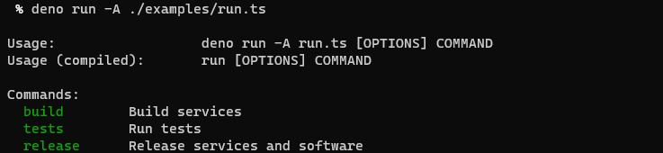
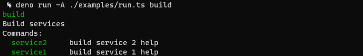
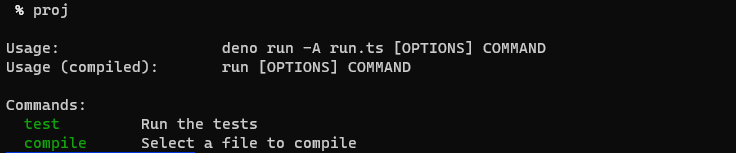

# proj

`proj` lets you use Typescript to create a management CLI for your project. 

You can run `proj` and see a hierarchical list of commands, along with help. This is `examples/run.ts`:


It says you can run `build`, `tests`, or `release`. You can do that like this:


And you can build one of these services like this (it's actually just running `examples/do_a_thing.sh`):


This is what this project's `proj` config currently shows:


You can compile and test this project using this script. To have `proj` work as a command see the quick-start below.

## Quick-start
You need to do the following:
  1. Create a `proj.ts` file that looks like `examples/run.ts`, or `./proj.ts`.
  2. Run it using `deno run --allow-run proj.ts`
  3. Make it easier to run by creating an alias in your `~/.bashrc` or `~/.zshrc` or whatever:
  ```
  alias proj="deno run --allow-run proj.ts"
  ```

You'll want to `source` your `rc` file, but then you'll be able to just run `proj` in any directory that has a `proj.ts` file and it'll run.

## Development

You can run tests and the examples and compile using `./proj.ts`. Run it as described in the quick-start, above..

## Motivation

`proj` lets you use Typescript to create a management CLI for your project. The key motivations are:

1. In a polyglot environment it's easy to forget how to build difference modules or projects. A unified interface is what we need.

2. It's easy to forget the useful commands you come up with. We need a non-awful, self-documenting place for these to live.

3. People use makefiles but they're intended for compiling and have several limitations.

4. This can be done in bash (in fact [I have](https://github.com/jamescoleuk/run_lib)) but when these scripts grow they're harder to manage without typing and test.

5. Projects need to provide an easy entry point for newcomers. With something like this you can explore what's possible, and maintain things easily.

## Who is this not for?
Are you wondering what's wrong with `scripts` in `package.json`, or why you wouldn't just do this in groovy in your `build.gradle`? Then you might not need this.

## What's left to do?
I'm still switching over from using [run_lib](https://github.com/jamescoleuk/run_lib) so I'm sure I'll discover lots of things I want to do. But right now parameters and arguments seem like they will be essential.